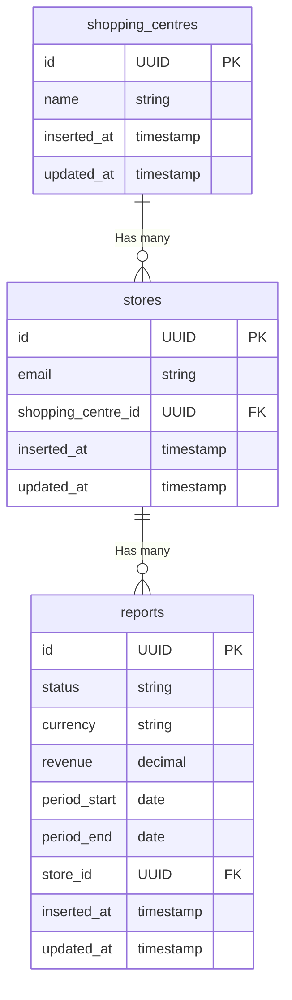

# Entity Relationship Diagram

```mermaid
erDiagram

shopping_centres ||--o{ stores : "Has many"
stores ||--o{ reports : "Has many"

shopping_centres {
    id UUID PK
    name string

    inserted_at timestamp
    updated_at timestamp
}

stores {
    id UUID PK
    email string

    shopping_centre_id UUID FK

    inserted_at timestamp
    updated_at timestamp
}

reports {
    id UUID PK
    
    status string

    currency string
    revenue decimal

    period_start date
    period_end date

    store_id UUID FK

    inserted_at timestamp
    updated_at timestamp
}
```
