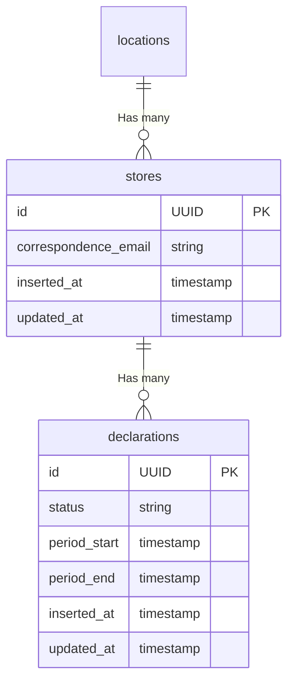

# Entity Relationship Diagram

```mermaid
erDiagram

locations ||--o{ stores : "Has many"
stores ||--o{ declarations : "Has many"

stores {
    id UUID PK
    correspondence_email string

    inserted_at timestamp
    updated_at timestamp
}

declarations {
    id UUID PK
    
    status string

    period_start timestamp
    period_end timestamp

    inserted_at timestamp
    updated_at timestamp
}
```
